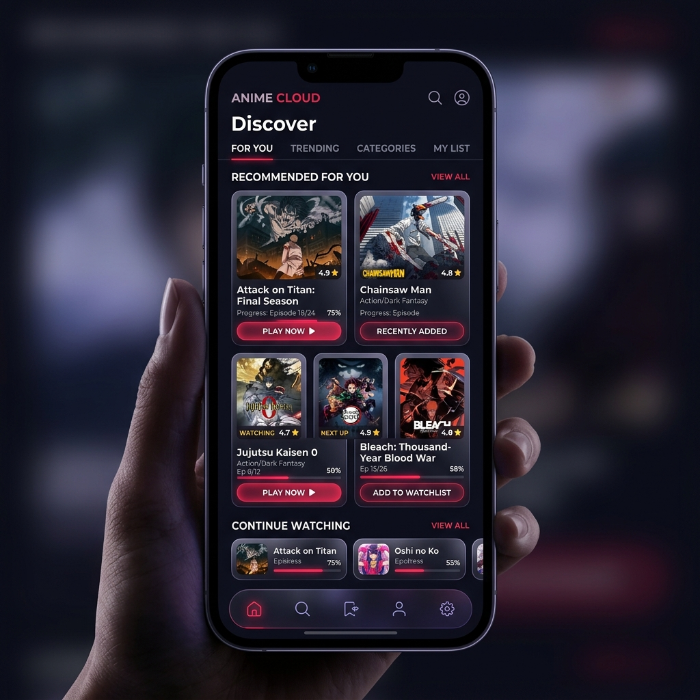

<div align="center">


# ⚔️ RoninX Anime Client 

### Read. Watch. Track.

[](https://flutter.dev/)
[](https://dart.dev)
[](https://supabase.com)
[](https://discord.gg/c2ZD8yEs4D)

**The official premium frontend client for the Ronin API ecosystem.**

An elegant, high-performance, open-source anime and manga companion app natively connected to the Ronin API proxy for lightning-fast media resolving. Syncs cleanly with MyAnimeList and AniList for seamless tracking and discovery.



</div>

---

## ✨ Features

- **📺 Advanced Media Player Engine**
  - Powered by `media_kit` for low-latency hardware-accelerated video playback.
  - Multi-server streaming adapter (direct streams and Playwright-based cloud resolvers).
  - Built-in player stability protection against rate limits and concurrent stream initialization crashes.
  - Custom fluid playback controllers with gesture-based volume/brightness scaling.

- **📖 Unified Manga & Webtoon Reader**
  - Native page rendering supporting page-by-page and long-strip webtoon scrolling.
  - **MangaDex API Integration**: Queries the official MangaDex API natively to deliver fast, unblocked English translations.
  - **Auto-Fallback Scraping**: Gracefully falls back to scraping mirrors like Manganato/Mangakakalot with smart 5-second timeouts to prevent reader hangs in blocked regions.

- **🔍 Segregated Search & Browse Tab**
  - Independent browsing tabs for **Anime** and **Manga** to isolate queries.
  - Powered by the robust **Kitsu API** for fast, detailed catalog search without server-side gateway bottlenecks.

- **☁️ Supabase Cloud Synchronization**
  - Instant watch histories, bookmarks, and user preferences synced with your Supabase backend.
  - Fail-safe initialization guards: detects network absence and boots up in local-only offline mode without throwing crashes.

- **📡 Network Resiliency**
  - Native internet state monitoring using `connectivity_plus`.
  - Visual connectivity warning banner alerting you of connection loss or server downtime.
  - Auto-retry and rate-limiting throttling queues for all API calls to prevent 429 errors.

- **🎨 Immersive AMOLED Theme**
  - Premium design system styled with custom **flex_color_scheme** tokens.
  - Sleek dark theme using deep charcoals, striking crimson, and gold accents.

---

## 🛠️ Technology Stack

- **Client Framework**: Flutter (Cross-platform builds for Android, Windows, and Linux)
- **Programming Language**: Dart
- **State Management**: Riverpod (`flutter_riverpod`)
- **Routing & Navigation**: GoRouter (`go_router`)
- **Database / Cache**: Supabase & Local Preferences (`shared_preferences`)
- **Playback Engine**: MediaKit (`media_kit` & `media_kit_video`)

<details>
<summary><b>View Project Dependencies</b></summary>

```yaml
dependencies:
  flutter_riverpod: ^2.6.1
  go_router: ^14.0.0
  supabase_flutter: ^2.9.0
  media_kit: ^1.1.11
  media_kit_video: ^1.2.4
  http: ^1.6.0
  encrypt: ^5.0.3
  html: ^0.15.6
  cached_network_image: ^3.4.1
  google_fonts: ^8.0.2
  shared_preferences: ^2.5.5
  connectivity_plus: ^6.0.3
```

</details>

---

## 🚀 Installation & Building

### Prerequisites
- Flutter SDK (Channel Stable)
- FVM (Flutter Version Manager) [Optional, but recommended]
- Platform build tools (Visual Studio for Windows, Clang/CMake for Linux, Android Studio for Android)

### Quick Start
```bash
# Clone the repository
git clone https://github.com/your-username/roninx-client.git
cd roninx-client

# Resolve dependencies
fvm flutter pub get

# Generate router and metadata code binders
fvm flutter pub run build_runner build --delete-conflicting-outputs

# Execute debug build on connected target
fvm flutter run
```

---

## ⚖️ LEGAL DISCLAIMER

RoninX Anime Client is a frontend user interface designed to organize metadata and query links.
- The app **does not host, upload, or own** any of the video streams, media files, or chapters displayed.
- All titles, schedules, covers, and synopses are fetched from public third-party APIs (AniList, Kitsu, MyAnimeList).
- Video streams are aggregated from public index servers. If you have inquiries regarding copyrighted material, please direct them to the third-party platforms hosting the content.

---

## RONINX PROPRIETARY LICENSE

1. **PROPRIETARY CODEBASE**  
   This repository and the RoninX Anime Client software ("RoninX") are private, proprietary code. No permission is granted to reproduce, copy, distribute, or modify this software without explicit written authorization from the copyright holder.

2. **NATURE OF INDEXING**  
   RoninX operates strictly as a search engine and directory crawler. It does not own or store media files. It merely aggregates index files from third-party networks dynamically upon user search.

3. **DMCA TAKEDOWN NOTICE WARNING**  
   Under 17 U.S.C. § 512(f), any person who knowingly materially misrepresents that material or activity is infringing may be subject to liability for damages, including costs and attorneys' fees. TARGETING INDEX TOOLS INSTEAD OF FILES HOSTING SITES WILL BE LEGALLY COUNTERED AS FRAUDULENT AND Baseless. We protect and defend our open-source research and indexers.

---

<div align="center">

**⚔️ RoninX Anime Client — Built for the Ronin Ecosystem.**

</div>

