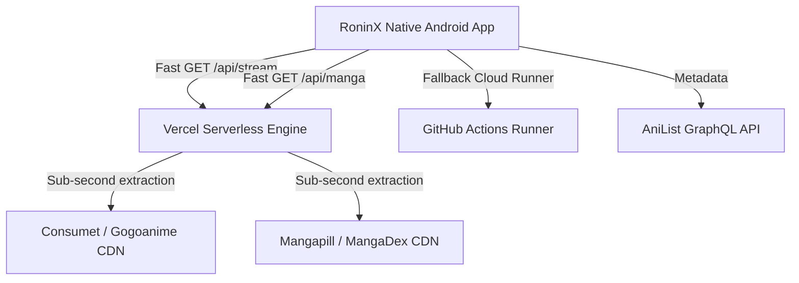

# RoninX Anime (Native Android) ⚡

[](https://developer.android.com)
[](https://kotlinlang.org/)
[](https://developer.android.com/jetpack/compose)
[](https://vercel.com)
[](LICENSE)

Welcome to the official repository of **RoninX Anime Client** — a high-performance, feature-packed **Native Android Anime & Manga App** built with modern Android standards (Jetpack Compose, Hilt, Media3 ExoPlayer, and Vercel Serverless Scrapers).

---

## 🌟 Key Features

### 🎬 Anime Streaming & Player
- **Sub-Second Stream Mining**: Powered by the **RoninX Vercel Serverless Engine** (`/api/stream`), extracting m3u8 streams and video embeds in under 1 second.
- **Media3 ExoPlayer Engine**: Native hardware-accelerated video player supporting adaptive m3u8 playback, resolution switching, and custom controls.
- **Advanced Player Controls**:
  - **Skip Intro (+85s)**: One-tap button to instantly skip intro sequences.
  - **Double-Tap Seek**: Seek ±10 seconds with fluid visual feedback.
  - **Picture-in-Picture (PiP)**: Continue watching while using other apps.
  - **Sensor Landscape Lock**: Auto-rotate video player based on device orientation.
  - **WebView Fallback**: Seamless embedded web player when direct m3u8 stream sources require browser contexts.

### 📖 Manga Reader
- **Instant Chapter Resolution**: Connected to the **RoninX Vercel Manga Engine** (`/api/manga`), fetching full chapter page image streams in seconds.
- **Dual Reading Modes**:
  - **Paged Mode**: Horizontal swiping reader with page counter overlay.
  - **Vertical Webtoon Mode**: Continuous vertical scrolling for webtoons and manhwa.
- **CDN Protection Bypass**: Integrated Coil `ImageRequest` with custom `Referer` and `User-Agent` headers to guarantee zero 403 Forbidden blocks.

### 📱 Native Android Experience
- **Glassmorphic Dark UI**: Custom Ronin Red design system built entirely with **Jetpack Compose (Material 3)**.
- **Multi-Source Metadata**: Aggregates trending anime/manga details from **AniList**, **Jikan (MAL)**, **Kitsu**, and **Shikimori**.
- **Smart History**: Local SQLite database via **Room** storing clean, deduplicated watch and read history.
- **Automated OTA Updates**: In-app update manager checking GitHub releases and commit SHAs with background APK downloading & installing.

---

## 🏗️ Architecture & Serverless Infrastructure

RoninX Anime uses a decoupled, serverless architecture that eliminates single-point-of-failure servers:


```mermaid
graph TD
    App[RoninX Native Android App] -->|Fast GET /api/stream| Vercel[Vercel Serverless Engine]
    App -->|Fast GET /api/manga| Vercel
    App -->|Fallback Cloud Runner| GHA[GitHub Actions Runner]
    Vercel -->|Sub-second extraction| Gogo[Consumet / Gogoanime CDN]
    Vercel -->|Sub-second extraction| Manga[Mangapill / MangaDex CDN]
    App -->|Metadata| AniList[AniList GraphQL API]
```

### ⚡ Serverless Scraper API Endpoints
- **Stream Scraper**: `GET https://roninx-app.vercel.app/api/stream?title={AnimeTitle}&episode={EpisodeNumber}`
- **Manga Reader Scraper**: `GET https://roninx-app.vercel.app/api/manga?title={MangaTitle}&chapter={ChapterNumber}`

---

## 🛠️ Tech Stack & Dependencies

- **Language**: Kotlin 1.9+
- **UI Framework**: Jetpack Compose with Material 3 & Navigation Compose
- **Dependency Injection**: Hilt / Dagger
- **Networking**: Retrofit 2, OkHttp 4, Gson
- **Media Engine**: AndroidX Media3 ExoPlayer 1.3+
- **Image Loading**: Coil Compose 2.6+
- **Local Storage**: Room Database & DataStore Preferences
- **Serverless Backend**: Vercel Node.js Functions & TypeScript

---

## 🚀 Building & Running

### Prerequisites
- Android Studio Ladybug (2024.2.1+) or newer
- JDK 17+
- Android SDK 34 (Minimum API level 26)

### Steps
1. **Clone the repository**:
   ```bash
   git clone https://github.com/Zcross091/RoninX-Anime-Client.git
   cd RoninX-Anime-Client
   ```

2. **Open in Android Studio**:
   Open the project folder in Android Studio and let Gradle sync dependencies.

3. **Build APK**:
   ```bash
   ./gradlew assembleRelease
   ```
   The built APK will be located at `app/build/outputs/apk/release/app-release.apk`.

---

## 🤝 Credits & Acknowledgments

- **AniList API**: Comprehensive GraphQL anime & manga database.
- **Consumet & MangaDex**: Open source scraper protocols and data endpoints.
- **Open Anime API**: Framework inspiration for stream mining algorithms.

---

Made with ❤️ by **RoninX Team**. Enjoy your ultimate native anime & manga experience! 🚀
