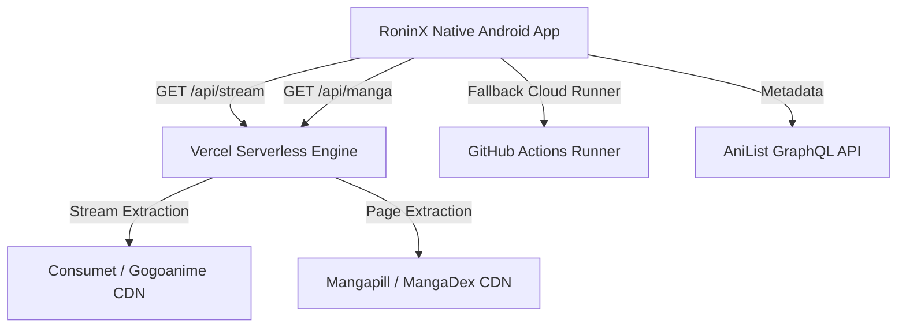

# RoninX Anime (Native Android)

[](https://developer.android.com)
[](https://kotlinlang.org/)
[](https://developer.android.com/jetpack/compose)
[](https://vercel.com)
[](https://discord.gg/c2ZD8yEs4D)
[](LICENSE)

Welcome to the official repository of **RoninX Anime Client** — a native Android anime and manga application built using Jetpack Compose, Hilt, Media3 ExoPlayer, and Vercel Serverless Scrapers.

---

## Community & Support

Join our official **[Discord Server](https://discord.gg/c2ZD8yEs4D)** for support, updates, feature requests, and community discussions!

---

## Key Features

### Anime Streaming & Player
- **Sub-Second Stream Mining**: Powered by the **RoninX Vercel Serverless Engine** (`/api/stream`), extracting m3u8 streams and video embeds.
- **Media3 ExoPlayer Engine**: Native hardware-accelerated video player supporting adaptive m3u8 playback, resolution switching, and custom controls.
- **Player Controls**:
  - **Skip Intro (+85s)**: One-tap button to skip intro sequences.
  - **Double-Tap Seek**: Seek ±10 seconds with visual feedback.
  - **Picture-in-Picture (PiP)**: Background playback support.
  - **Sensor Landscape Lock**: Device orientation locking.
  - **WebView Fallback**: Embedded web player fallback when direct m3u8 stream sources require browser contexts.

### Manga Reader
- **Instant Chapter Resolution**: Integrated with the **RoninX Vercel Manga Engine** (`/api/manga`), fetching chapter page image streams.
- **Dual Reading Modes**:
  - **Paged Mode**: Horizontal swiping reader with page counter.
  - **Vertical Webtoon Mode**: Continuous vertical scrolling for webtoons and manhwa.
- **CDN Bypass**: Coil `ImageRequest` with custom `Referer` and `User-Agent` headers to prevent 403 Forbidden errors.

### Native Android Experience
- **Compose UI**: Glassmorphic dark theme built with Jetpack Compose (Material 3).
- **Multi-Source Metadata**: Fetches anime and manga details from AniList, Jikan (MAL), Kitsu, and Shikimori.
- **Watch History**: Local SQLite database via Room storing deduplicated watch and read history.
- **OTA Updates**: In-app update manager checking GitHub releases and commit SHAs with background APK download and installation.

---

## Architecture & Infrastructure

RoninX Anime uses a serverless architecture designed for efficiency and speed:


```mermaid
graph TD
    App[RoninX Native Android App] -->|GET /api/stream| Vercel[Vercel Serverless Engine]
    App -->|GET /api/manga| Vercel
    App -->|Fallback Cloud Runner| GHA[GitHub Actions Runner]
    Vercel -->|Stream Extraction| Gogo[Consumet / Gogoanime CDN]
    Vercel -->|Page Extraction| Manga[Mangapill / MangaDex CDN]
    App -->|Metadata| AniList[AniList GraphQL API]
```

### Serverless API Endpoints
- **Stream Scraper**: `GET https://roninx-app.vercel.app/api/stream?title={AnimeTitle}&episode={EpisodeNumber}`
- **Manga Scraper**: `GET https://roninx-app.vercel.app/api/manga?title={MangaTitle}&chapter={ChapterNumber}`

---

## Tech Stack & Dependencies

- **Language**: Kotlin 1.9+
- **UI Framework**: Jetpack Compose (Material 3 & Navigation Compose)
- **Dependency Injection**: Hilt
- **Networking**: Retrofit 2, OkHttp 4, Gson
- **Media Engine**: AndroidX Media3 ExoPlayer 1.3+
- **Image Loading**: Coil Compose 2.6+
- **Local Storage**: Room Database
- **Backend API**: Vercel Node.js Functions (TypeScript)

---

## Building & Running

### Prerequisites
- Android Studio Ladybug (2024.2.1+) or newer
- JDK 17+
- Android SDK 34 (Minimum API level 26)

### Steps
1. Clone the repository:
   ```bash
   git clone https://github.com/Zcross091/RoninX-Anime-Client.git
   cd RoninX-Anime-Client
   ```

2. Open in Android Studio and sync Gradle dependencies.

3. Build Release APK:
   ```bash
   ./gradlew assembleRelease
   ```
   Output APK location: `app/build/outputs/apk/release/app-release.apk`.

---

## Credits & Acknowledgments

- **AniList API**: GraphQL anime & manga database.
- **Consumet & MangaDex**: Open source scraper protocols and data endpoints.
- **Open Anime API**: Framework reference for stream mining logic.

---

Maintained by **RoninX Team**.

